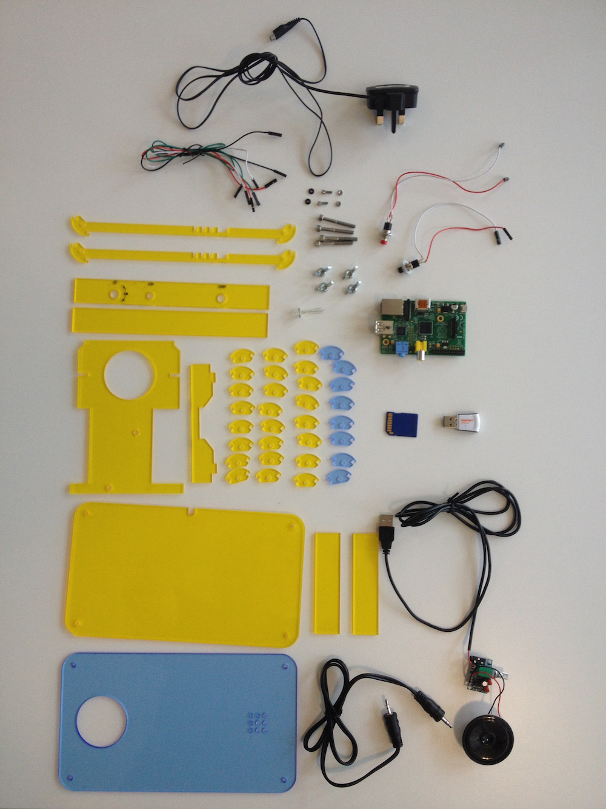
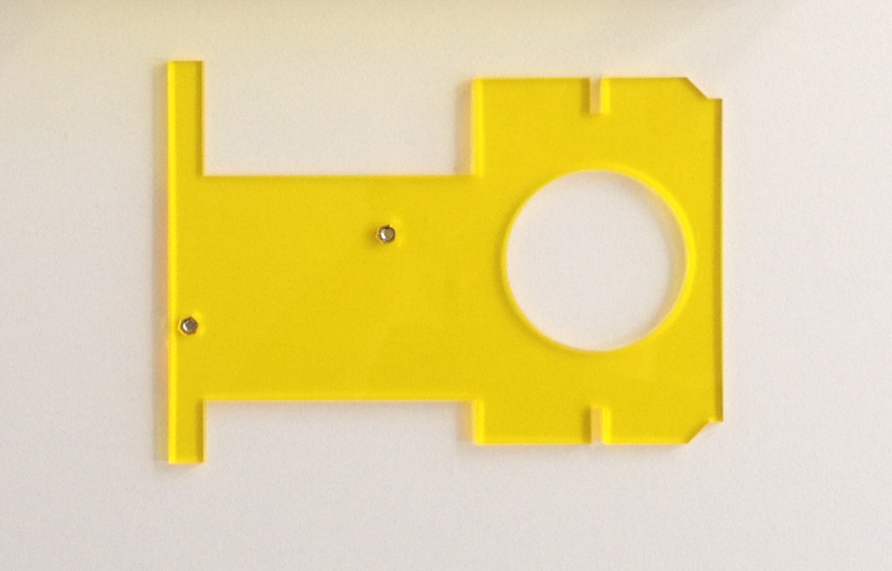
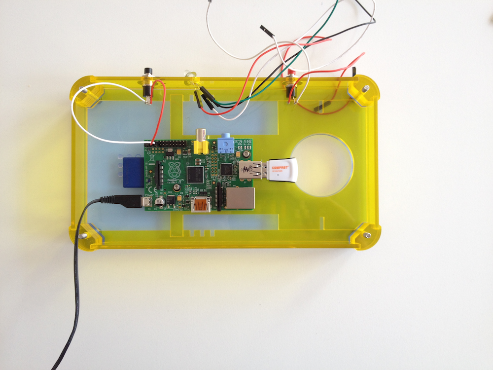
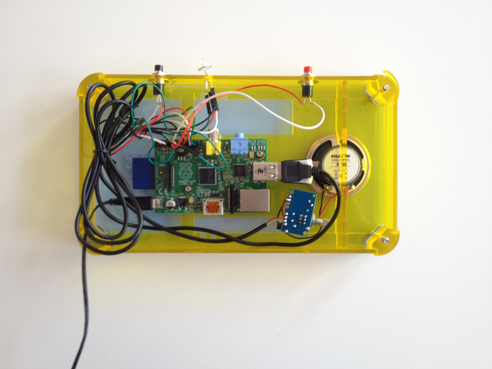

Basic instructions for building a Radiodan
==========================================

This is a first pass at a set set of instructions. We're still testing it.

In general: the [case](assets/radiodan_3mm_laser_template.pdf) is designed (by [Victor Johannsen](https://twitter.com/victordons)) to be something that can be changed and adapted to the size of different components. 

Here we use a USB amp and a 5cm diameter speaker, but we've also experimented with versions with [cheap miniature speakers](http://www.amazon.co.uk/Veho-Rechargeable-Speaker-iPods-Players/dp/B002CS2T4I/ref=sr_1_1) instead, though in that case you may need to increase he 
number of corner pieces and make the side pieces wider (and the sound won't be as good). 

It's also designed to be laser cut in 3mm acrylic or MDF, but we have made versions successfully in cardboard, although the button press 
movements mean that the top piece and supporting side bar need to be quite stiff. You can event cut the pieces out yourself with a craft 
knife, though we're working on a simpler, squarer version for that.

We have struggled with finding an effective and simple way to connect the rotary encoders to the Pi's GPIO, because the encoders' connectors 
are very close to gether and they use up most of the ports on the GPIO. We are working on a simpler version with two buttons.

For getting the software working, see [getting started](getting_started.markdown)

Step 0: Kit of parts
====================

Here's what you need. 

The case ([pdf](assets/radiodan_3mm_laser_template.pdf)) is designed for a 5cm speaker powered by a USB-powered amplifier, such as [this one](http://www.ebay.com/itm/PAM8403-USB-Power-Cable-Stereo-Audio-Digital-Amplifier-Board-2-Channel-3W-2-UK-/121375724376?).

Missing from this picture are the wires soldering the USB amp to the speaker. Also missing is a short male to male 3.5mm audio jack.

The complete list is this:
 * a case [pdf](assets/radiodan_3mm_laser_template.pdf)
 * a USB wifi card, *RT5370 chipset*
 * a USB-powered amp soldered to a 5cm diameter speaker, and a short male to male 3.5mm audio jack
 * 2 rotary encoders and one button, soldered to wire with a female socket at the other end to fit the Raspberry Pi's GPIO
 * a Raspberry Pi, any model
 * a power supply for the Pi
 * 4 3mm diameter bolts, 4cm or more in length, and 4 wingnuts or similar
 * 4 5mm diameter nuts to fit short 2mm diameter screws to hold in the Pi

Step 1: Add the four bolts and the two internal mounts
======================================================

Play particular attention to the placement of the arrows - they should point to the circular hole.

Step 2: Add the four edge pieces
================================

Make sure the top piece is the right way up and the correct way round (text faces outwards).

Step 3: Add the corner pieces
=============================

There are 8 on each corner.

Step 4: Glue the nuts to the internal mount
===========================================

Glue the nuts into the mount first. The mount fits both the model B and the new B+, but you need to glue the nuts into different holes 
depending on your model. The B+ holes are identified with a plus sign. It's easier to apply the glue to the holes, situate the screws in rough position on a flat surface and then manouver the internal mount piece over the top.

Step 5: Add the internal mount
==============================

When the glue is set, fit the mount into the box, slotting it into the side pieces.

Step 6: Wire up the buttons and dials and attach them to the top
================================================================

For the wiring you need to consult this [fritzing diagram](assets/Radiodan_app.fzz).

The wiring is omitted in this picture.

Step 7: Add the speaker
=======================

The speaker should sit tightly in the hole. Wiring is also ommitted here; in fact the speaker will be wired to the amp.

Step 8: Add the Raspberry Pi
============================

Add the Pi on top of the internal mount, aligning the holes in the board with the screws. The orientation will be different depending which version of the Pi you have.

Step 9: Screw the Pi to the internal mount
==========================================

Screw the Pi into the holes with the small screws, using the rubber washers.

Step 10: Add the speaker mount
==============================

It fits tightly into the gap between the internal mount and the side pieces, and holds the speaker in.

Step 11: Add the USB Amp and wifi card
======================================

Connect the amp to the USB port and to the 3.5mm jack.
Connect the wifi card to another USB port.

Step 12: Plug in the power supply
=================================

Plug the micro USB power cable into the Pi.

Step 13: Add the back of the case
=================================

Using the butterfly screws, and feeding the power cable through the hold in the back of the case.

