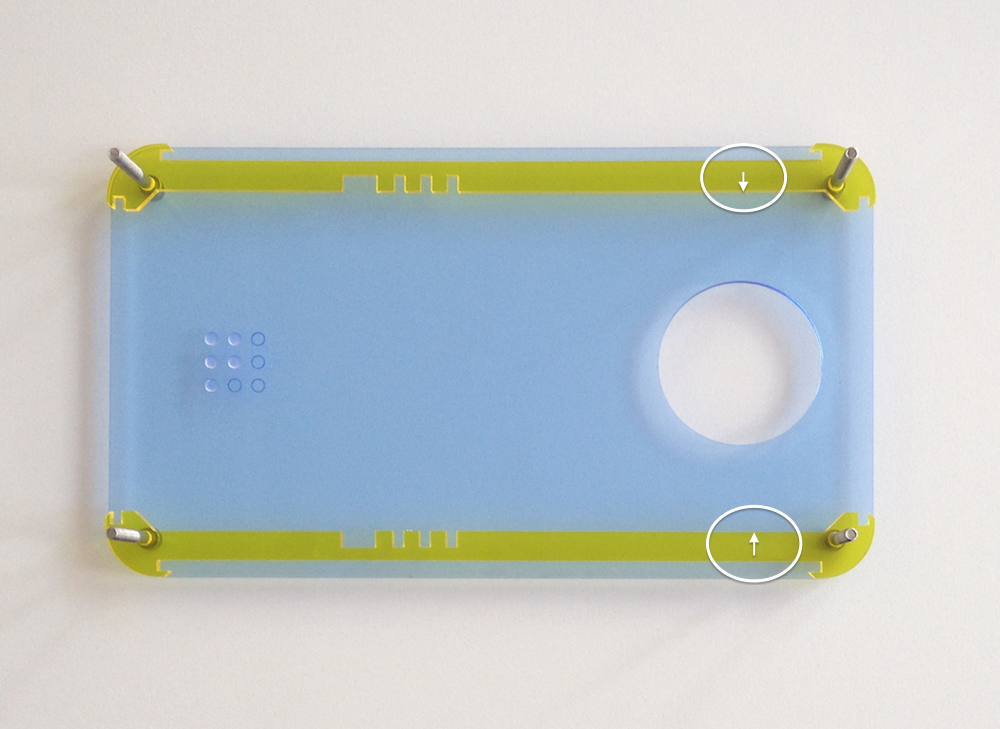
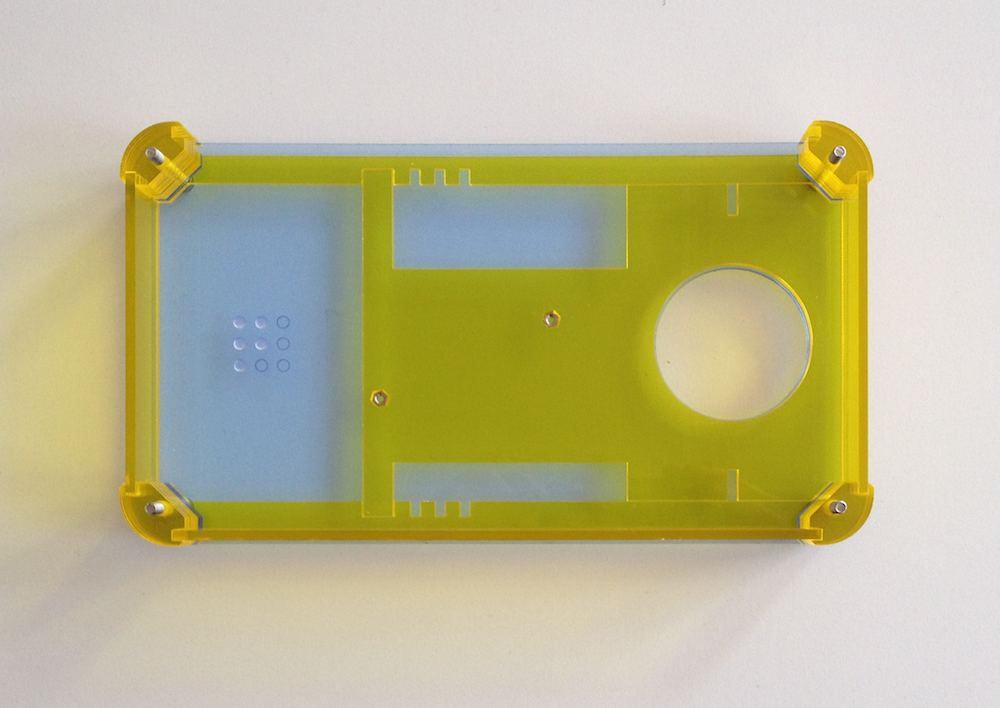
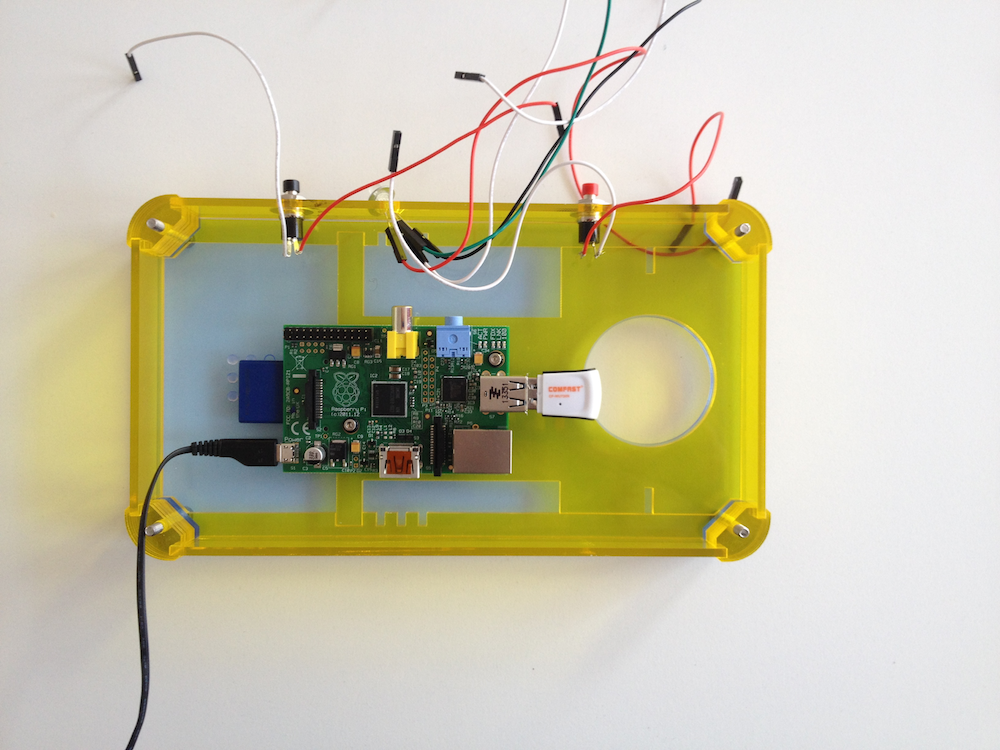
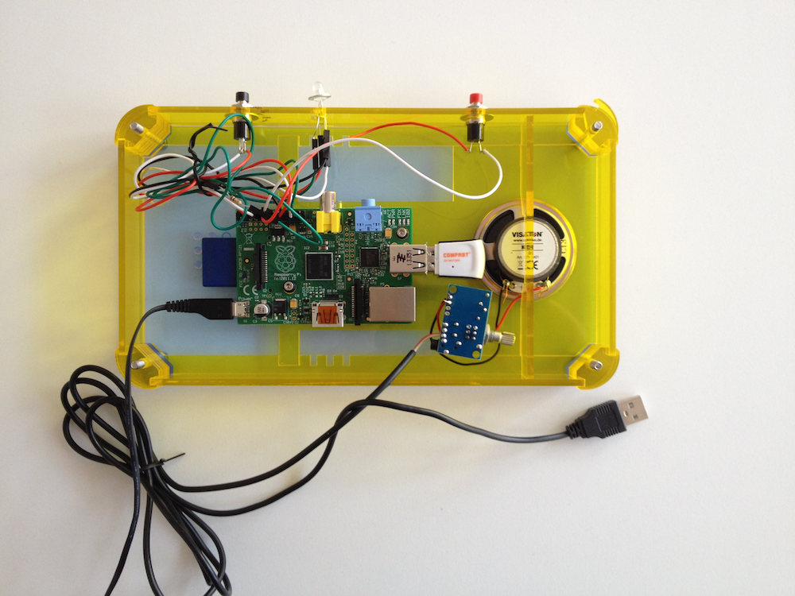
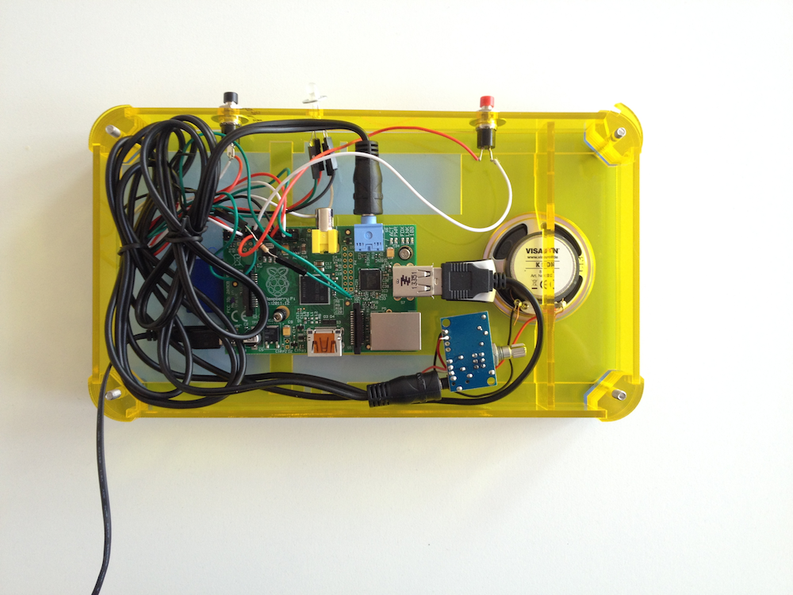
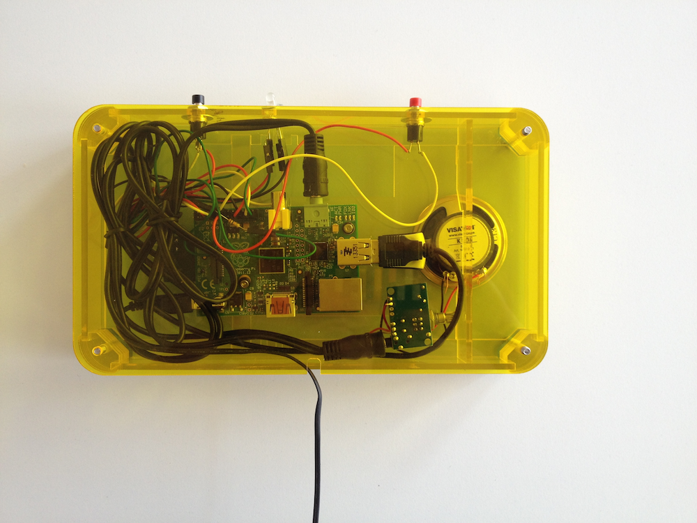

Basic instructions for building a Radiodan
==========================================

This is a first pass at a set set of instructions. We're still testing it.

In general: the [case](assets/radiodan_3mm_laser_template.pdf) is designed (by [Victor Johannsen](https://twitter.com/victordons)) to be something that can be changed and adapted to the size of different components. 

Here we use a USB amp and a 5cm diameter speaker, but we've also experimented with versions with [cheap miniature speakers](http://www.amazon.co.uk/Veho-Rechargeable-Speaker-iPods-Players/dp/B002CS2T4I/ref=sr_1_1) instead, though in that case you may need to increase the 
number of corner pieces and make the side pieces wider (and the sound won't be as good). 

It's also designed to be laser cut in 3mm acrylic or MDF, but we have made versions successfully in cardboard, although the button press 
movements mean that the top piece and supporting side bar need to be quite stiff. You could even cut the pieces out yourself with a craft 
knife, though we're working on a simpler, squarer version for that.

We have struggled with finding an effective and simple way to connect rotary encoders (for 
volume for example) to the Pi's GPIO, because the encoders' connectors are very close 
together and they use up most of the ports on the GPIO.

The version below is a simpler version with two buttons (on / off and a configurable 
'magic' button) and an RGB status LED.

For getting the software working, see [getting started](getting_started.markdown)

Step 1: Kit of parts
====================

Here's what you need. 

The case ([pdf](assets/radiodan_3mm_laser_template.pdf)) is designed for a 5cm speaker powered by a USB-powered amplifier, such as [this one](http://www.ebay.com/itm/PAM8403-USB-Power-Cable-Stereo-Audio-Digital-Amplifier-Board-2-Channel-3W-2-UK-/121375724376?).

The complete list is this:
 * a case [pdf](assets/radiodan_3mm_laser_template.pdf)
 * a USB wifi card, *RT5370 chipset*
 * a USB-powered amp soldered to a 5cm diameter speaker, and a short male to male 3.5mm audio jack
 * two buttons and an RGB LED, all soldered or connected to wire with a female socket at the other end to fit the Raspberry Pi's GPIO. The LED needs a 10k resistor connected to its negative leg
 * a Raspberry Pi, any model
 * a power supply for the Pi
 * 4 3mm diameter bolts, 4cm or more in length, and 4 wingnuts or similar
 * 2 5mm diameter nuts to fit 2 short 2mm diameter screws to hold in the Pi

Step 2: Add the four bolts and the two internal mounts
======================================================

Play particular attention to the placement of the arrows - they should point to the circular hole.

Step 3: Glue the nuts to the internal mount
===========================================

Glue the nuts into the mount first. The mount fits both the model B and the new B+, but you need to glue the nuts into different holes 
depending on your model. The B+ holes are identified with a plus sign. It's easier to apply the glue to the holes, situate the screws in rough position on a flat surface and then manouver the internal mount piece over the top.

Step 4: Add three of the edge pieces, the corner pieces, and the internal mount
===============================================================================

When the glue is set, fit the mount into the box, slotting it into the side pieces.

There are 8 corner pieces on each corner.

The three edge pieces just slot in.

Step 5: Wire up the buttons and leds and attach them to the top
===============================================================

Make sure the top piece is the right way up and the correct way round (text faces outwards and the power button is on the right as you face it).

For the wiring you need to consult this [fritzing diagram](assets/Radiodan_app.fzz)@@fixme.

Step 6: Add the wifi card, SD card and power supply to the Pi
=============================================================

Don't plug the Pi in yet.

Put the wifi card in the bottom USB slot.

Step 7: Put the Pi in the box
=============================

Secure it with the screws and the rubber washers.

Step 8: Attach the Wires to the Pi's GPIO
=========================================

Use [this wiringpi pin naming scheme](https://projects.drogon.net/raspberry-pi/wiringpi/pins/)

The power button attaches to pin 7, the magic button to pin 2, and the status RGB led to pins 12, 13 and 14.

Step 9: Add the speaker
=======================

The speaker should sit tightly in the hole. 

Step 10: Add the speaker mount
==============================

It fits tightly into the gap between the internal mount and the side pieces, and holds the speaker in.

Step 11: Add the USB Amp
========================

Connect the amp to the top USB port.

Step 12: Connect the AMP to the 3.5mm audio connector
=====================================================

Step 13: Add the back of the case
=================================

Using the butterfly screws, and feeding the power cable through the hold in the back of the case.

Step 14: Enjoy your Radiodan
============================

Plug in the Radiodan and wait a minute. Click the power button or use the [web interface](http://raspberrypi.local) to turn on the radio.

